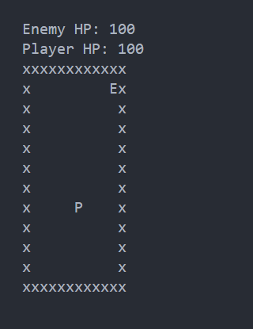

# Nevers Space Shooting
This game is an assignment of my backend lead in my current company that I've working for.

The objective of this game is just to move and shoot the Enemy 'E' by press 'Space Bar' to shoot, if the enemy is dead then you win this game.



## Flow Chart


## Start
```bash
go run main.go
```

## Exit
To exit just press 'ESC' key on your keybaord.

## Warning
This game can make your CPU work hard. Don't play for too long!

## Features
- 2D Map
- Player
- Enemy
- Attacking
- Reduce Enemy HP
- Critical Hit Chance

## Need to Improve
- Enemy Attack Logic