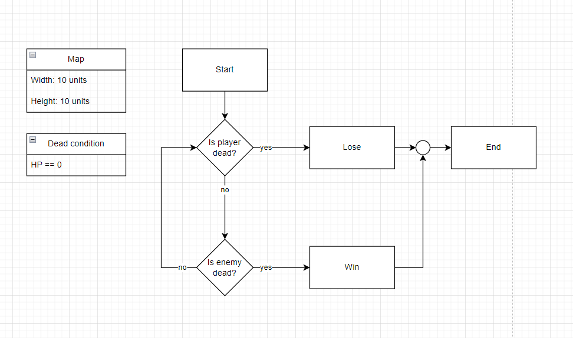

# Nevers Space Shooting
This game is an assignment of my backend lead in my current company that I've working for.

The objective of this game is just to move and shoot the Enemy 'E' by press 'Space Bar' to shoot, if the enemy is dead then you win this game.

## Flow Chart

## Features
- 2D Map
- Player
- Enemy
- Attacking
- Reduce Enemy HP

## Need to Improve
- Player Dead Logic
- Enemy Move Logic
- Enemy Attack Logic